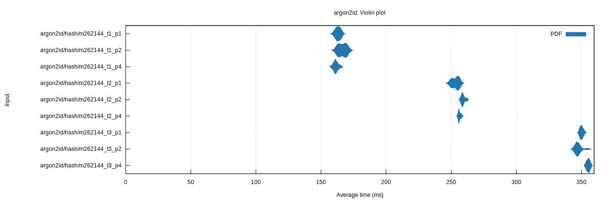

# Argon2Bench

A performance benchmarking tool for Argon2id password hashing algorithm parameters.

## Overview

This project uses [Criterion.rs](https://github.com/bheisler/criterion.rs) to benchmark various parameter combinations of the Argon2id password hashing algorithm, measuring computation time for different configurations.

### Benchmark Parameters

- **Memory (m)**: 16MB to 1GB, step 16MB (64 values)
- **Time cost (t)**: 1, 2, 3
- **Parallelism (p)**: 1, 2, 4

Total: **576** parameter combinations.

## Usage

```bash
cargo bench
```

## OWASP Recommended Parameters

According to [OWASP Password Storage Cheatsheet](https://cheatsheetseries.owasp.org/cheatsheets/Password_Storage_Cheat_Sheet.html):

> Argon2id has three configurable parameters: minimum memory size (m), minimum number of iterations (t), and degree of parallelism (p).

Recommended configurations:

| Memory (m)     | Iterations (t) | Parallelism (p) | Notes                   |
| -------------- | -------------- | --------------- | ----------------------- |
| 47104 (46 MiB) | 1              | 1               | Do not use with Argon2i |
| 19456 (19 MiB) | 2              | 1               | Do not use with Argon2i |
| 12288 (12 MiB) | 3              | 1               |                         |
| 9216 (9 MiB)   | 4              | 1               |                         |
| 7168 (7 MiB)   | 5              | 1               |                         |

## Results

Benchmark results are stored in `target/criterion/`:

- **HTML Report**: `target/criterion/argon2id/report/index.html`
- **Raw Data**: `target/criterion/argon2id/hash_m*_t*_p*/`

## Dependencies

- [argon2](https://crates.io/crates/argon2) - Argon2 implementation
- [criterion](https://crates.io/crates/criterion) - Benchmarking framework
- [itertools](https://crates.io/crates/itertools) - Iterator utilities (Cartesian product)

## Benchmark Environment

Results below were obtained on the following system configuration:

| Component | Specification                 |
| --------- | ----------------------------- |
| CPU       | AMD Ryzen 9 7945HX (16 cores) |
| Memory    | 46 GB RAM                     |
| OS        | Debian GNU/Linux (forky/sid)  |
| Kernel    | 6.9.12-x64v4-xanmod1          |

> [!NOTE]
> For production workloads, run benchmarks on your target hardware to ensure
> accurate performance estimates for your specific environment.



## License

MIT
